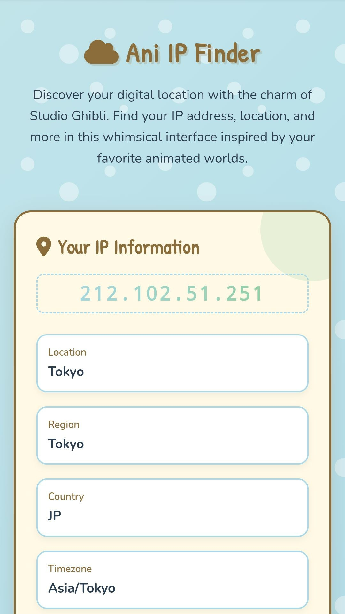

<div align="center">
  <a href="https://github.com/Shineii86">
    
  </a>
  
 # Ani IP Finder
  
</div>


[](https://opensource.org/licenses/MIT)
[](https://github.com/yourusername/ghibli-ip-finder)
[](https://github.com/yourusername/ghibli-ip-finder)

Discover your digital location with the charm of Studio Ghibli! This whimsical web application displays your IP address, location details, and shows your approximate location on an interactive map - all wrapped in a delightful Ghibli-inspired design.

##  Preview

| Section	Preview |
| :--: |
|	 | 

## Features ✨

- **Ghibli-inspired Design**: Soft pastel colors, Totoro character, and cloud motifs
- **IP Information Display**: Shows public IP address and detailed location data
- **Interactive Map**: Leaflet.js map with custom Ghibli-style marker
- **Advanced Controls**: Refresh, copy IP, and VPN/proxy detection
- **Social Links**: Beautiful footer with animated social media icons
- **Responsive Layout**: Works on desktop, tablet, and mobile devices

## How to Use 🚀

1. Clone the repository:
```bash
git clone https://github.com/yourusername/ghibli-ip-finder.git
```
2. Open `index.html` in any modern web browser
3. The application will automatically detect your IP address and location

## Controls:
- [x] Refresh IP: Fetch latest IP information
- [x] Copy IP: Copy your IP address to clipboard
- [ ] Check VPN: Simulates VPN/Proxy detection

## Technologies Used 🛠️
- HTML5, CSS3, JavaScript
- Leaflet.js for interactive maps
- Axios for API requests
- Font Awesome for icons
- Google Fonts for typography

##  Loved My Work?

&nbsp;[Give a star to this project](https://github.com/Shineii86/AniEmojis/) <br/>
&nbsp;[Follow me on GitHub](https://github.com/Shineii86/Shineii86)<br/>

>  Wondering where to get these animated emojis?
> [Visit here!](https://github.com/Shineii86/AniEmojis) You also should look around my other github repos. Maybe you'll find some cool useful stuff there.

##  Contact
> For inquiries or collaborations:
  
[](https://telegram.me/Shineii86 "Contact on Telegram")
[](https://instagram.com/ikx7.a "Follow on Instagram")
[](https://www.snapchat.com/add/ikx7.a "Add on Snapchat")
[](https://facebook.com/ikx7.a "Connect on Facebook")
[](https://twitter.com/Shineii86 "Follow on Twitter (X)")
[](https://wa.me/ "Chat on WhatsApp")
[](https://pinterest.com/ikx7a "Follow on Pinterest")
[](mailto:ikx7a@hotmail.com "Send an Email")


<div align="center">
  
[](https://github.com/Shineii86/Shineii86/commits)
  
  <sup><b>Copyright © 2025 <a href="https://telegram.me/Shineii86">Shinei Nouzen</a> All Rights Reserved</b></sup>
</div>

